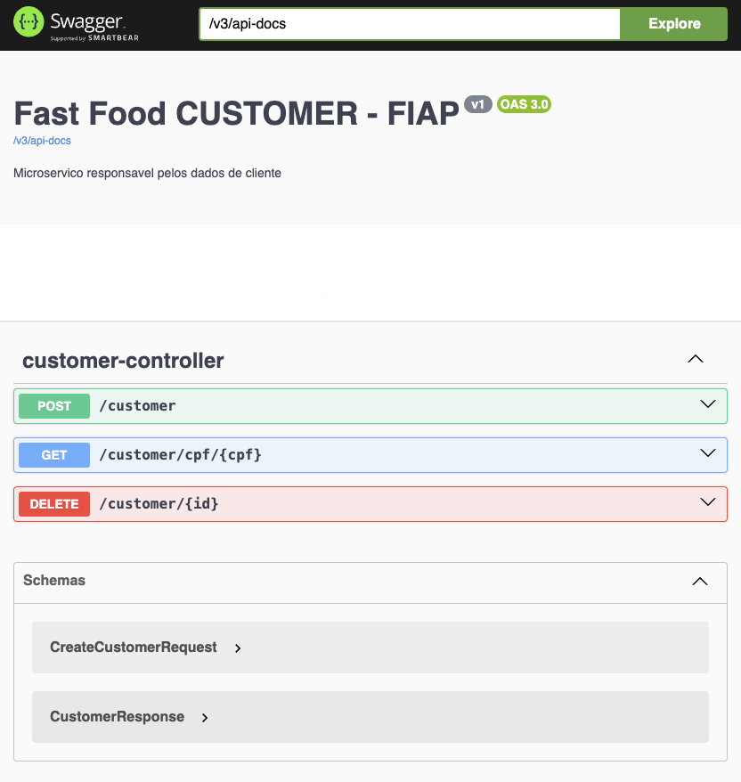
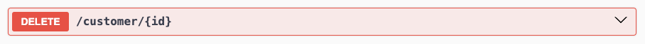

# 🚀 FIAP : Challenge Pós-Tech Software Architecture
## 🍔 Microserviço fiap-fastfood-customer

Microserviço responsável pelos dados dos clientes, faz parte da Fase 5 da Pós-Graduação de Arquitetura de Sistemas da FIAP.

### 👨‍🏫 Grupo

Integrantes:
- Diego S. Silveira (RM352891)
- Kelvin Vieira (RM352728)
- Wellington Vieira (RM352970)

### 💻 Tecnologias

Tecnologias utilizadas:

* Java 17
* Spring Framework
* Gradle
* MongoDB
* Docker
* Swagger
* Cloud AWS
* Kubernetes

### 👓 Serviços Utilizados

* Github
* Postman
* Docker Desktop
* MongoDB Compass
* k9s
* Minikube
* AWS CLI
  
 
  
### 🔌 Swagger
<HOST>/swagger-ui/index.html#/

 

### 📄 LGPD - Relatório de Impacto à Proteção de Dados Pessoais

[Link do relatório RIPD](https://drive.google.com/file/d/1G3jQLqwc--3KZXfPG5Mm1lM7jJOa4Gqc/view?usp=sharing)

PDF RIPD:
misc/RIPD-FiapFastFood.pdf

Endpoint para remover dados do cliente e atender a LGPD

 

## Version

1.0.0.0
